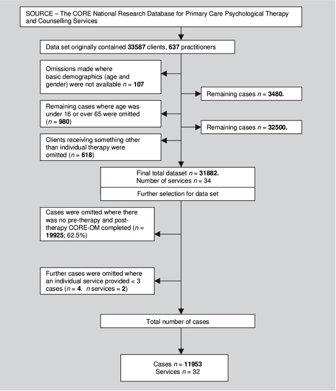

---
title: "CMPH 133: Group Project Analysis Template"
author: Write Your Names Here
date: "`r Sys.Date()`"
output: 
  html_document:
    toc: TRUE
    toc_depth: 4
    toc_float: TRUE
    code_folding: hide
---

```{r setup, include=FALSE}
knitr::opts_chunk$set(echo = TRUE)
```


<!-- This is how you add comments in your Markdown file. Anything appearing here will not appear when you Knit this file. If you need to leave comments for yourself as you work on this document, you can use this technique.-->


**Change the title to something more meaningful**


### Ready the Workspace

```{r ready the workspace, message=FALSE}
# include all your packages/libraries in this code chunk

# library(ggplot2) 

```


### Import and Clean the Dataset

<!-- In the code chunk below do the following:

1. Import the raw dataset

2. Clean it and modify it as needed

3. Once you are done cleaning/modifying the data, save the cleaned 
   version of the dataset as a .csv file using:
   write.csv(dd, "name_of_cleaned_data.csv", row.names=FALSE) 
   where you will change "dd" to the actual name of your data object;
   "name_of_cleaned_data.csv" to whatever name you want to save the new 
   dataset as. 

4. Now that you have exported the cleaned dataset, you don't need to re-run
   this whole process of data cleaning every single time you knit your RMD. 
   Only AFTER you have completed Step 3, change the R Chunk header below to:
   {r import and clean dataset, results='hide', eval=FALSE} 
   This will leave the code in your knitted file, but it will NOT evaluate
   it when you knit the file (and hence save you some time) -->


```{r import and clean dataset, results='hide', eval=FALSE}
# Import your dataset here, and then clean it in this code chunk

```


<!-- AFTER you have completed Step 4 above: 
  5. Import the cleaned dataset that you had saved as a .csv file in 
     Step 3 -->

```{r import cleaned dataset}

```


# Abstract

Write your abstract here using the following four sections. The abstract should not be more than 250 words: <!-- Delete this text when you start writing your abstract -->

 **Background**: Problem being addressed in the study  <!-- Replace this text with your Background text -->
 
 
 **Methods**: How the study was conducted <!-- Replace this text with your Methods text -->
 
 
 **Results**: Salient results  <!-- Replace this text with your Results text -->
 
 
 **Conclusion**: Contextualize findings/conclusions from study results  <!-- Replace this text with your Conclusion text -->
 
 
*Note:* The Background, Methods, and Conclusion sections usually have 2-3 sentences only. The Results section can have more than that. Focus on interesting/important findings in the Results section here, *not* all results. See [this article from NEJM](https://www.nejm.org/doi/full/10.1056/NEJMoa2515458) for an example. <!-- Delete this text when you start writing your abstract -->


# Introduction

- Provide a brief paragraph on background for your research question; what is known, what is not known, why is this research area important; what is the population of interest; who will benefit from this research?

- Outline the overall broader research question, and then provide your specific research hypothesis. Include what you expect to see (it may or may not end up being true, but write what you had expected to see at the start of the project). 

- In the final version, this should be a well written introduction in prose form, with multiple paragraphs. During the draft phase, you can start out by using bullet points to list all the ideas you want to discuss.


# Methods

- Describe your study and the dataset (e.g. if you are working with NHANES, briefly describe the data collection process, sample size, year the data were collected, etc. If you are working with data collected by your preceptor, get this information from them - how were subjects recruited, how many were targeted, how were the data collected, etc). 

- Describe the inclusion/exclusion criteria, as well as the numbers before and after. Include a data cleaning flowchart as an image (see Figure 1 below for an example).

<!-- The following code gives the default way of including an image into your RMD file, along with a caption. But it does not allow a lot of customization. -->



- Describe the broader concepts for exposure and outcome variables, and how they are actually measured/represented in your study. Cite evidence or theoretical backing for why this particular measure is a valid construct for the concept you are trying to capture, and exactly what dimension of your concept it actually captures. For example, your research question might be "Too much screen time is bad for cardiovascular health"; "screen time" and "cardiovascular health" are broad concepts. In your study, how exactly do you define/measure these concepts? Perhaps you define screen time as *number of minutes on the phone per day while not performing a work related task* and cardiovascular health as *average systolic blood pressure based on measuring it on five consecutive days*. Discuss what aspect of "screen time" and "cardiovascular health" these specific measures of these concepts actually capture; what are the pros and cons/strengths and weaknesses of these particular measures.

- Discuss what additional variables you plan to include in your analysis, and what role these variables will play. Include your DAG here. See Figure 2 below for an example. 

<!-- The following code gives an alternative way to imbed images into your RMD that allows a lot more customization, e.g. centering the image/caption, changing the image size, etc. 

NOTE: for this code to run, you must install the package "here" (install.packages("here")) -->

```{r DAG, fig.align = 'center', out.width = "40%", fig.cap = "**Figure 2:** My DAG"}
knitr::include_graphics(here::here("DAG.png"))
```


- Describe what statistical analysis you will conduct, and what approach you will take for building the model, what diagnostic tests you will conduct, and how you intend to address any violations of model assumptions. Also discuss any sensitivity analyses that you will conduct, if appropriate. 


- You can choose to create sub-sections as needed to better organize this section (but it is not required).


# Supplementary Material {.tabset}

This section includes all your analysis. We will look at this section while reading the other sections. But think of all the output produced in these sections as what would go into the Supplementary Material for a published article; i.e., a reader may or may not read this section. Therefore, if there are any tables or plots that you want the reader to definitely read, they **must be reproduced in the Results section.** <!-- Delete this text before you submit your RMD file. --->

## Initial Exploratory Data Analysis {.tabset}


### Univariate Analysis {.tabset}

Include your Univariate Analysis here. *After each analysis, include 1-2 sentences describing the distribution of the variable.*

#### Outcome

```{r}
hist(rnorm(5000))

summary(rnorm(5000))
```

The distribution looks...


#### Primary Exposure 

```{r}
hist(rnorm(5000))

summary(rnorm(5000))
```

The distribution looks...

#### Potential Confounders and other Covariates

```{r}
table(c(rep(1, 50), rep(0, 30)))
barplot(table(c(rep(1, 500), rep(0, 100))))
```

The distribution looks...

```{r}
hist(rnorm(5000))

summary(rnorm(5000))
```

This distribution looks...


### Bivariate Analysis {.tabset}

Include your Bivariate Analyses here. *After each analysis, include 1-2 sentences describing the relationship you observe.*


#### Outcome vs. Exposure 


#### Outcome vs. Potential Confounders


#### Associations between Potential Confounders


### Summary {.active}

Summarize the findings from the univariate and bivariate analyses here. 


## Model Building {.tabset}

### Regression Model


### Model Diagnostics


### Sensitivity Analysis


# Results

Describe your findings. 

Reproduce any tables or plots that you already created in the Supplementary Material section that you definitely want the reader to see. 

Make sure to include Table 1 here. If your primary exposure is continuous, then instead of the Table 1 that we discussed, include a table that provides the univariate summary of each variable (both continuous and categorical variables).


# Conclusion

Write an overall conclusion: 

provide context for your findings;

how they compare to your hypotheses;

explanations for your results;

**Competency:** Propose an improvement in a public health program, policy, or system
